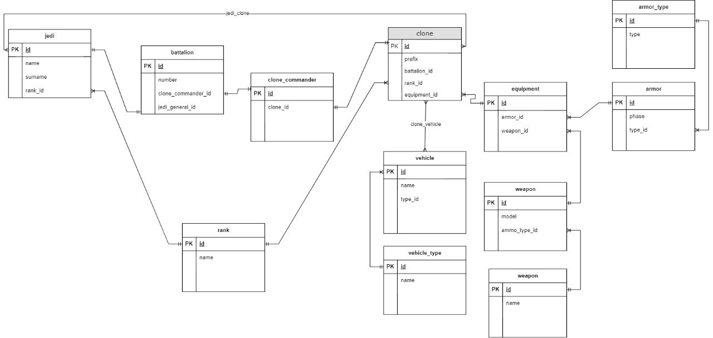
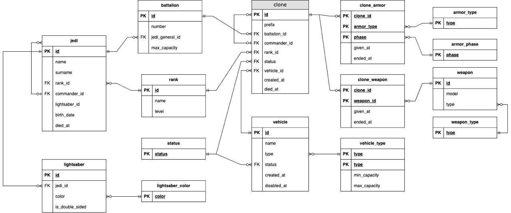

# Рефакторинг базы данных

Текущая реализованная инфологическая схема базы данных:

## Рефакторинг:

1. Как можно заметить, сразу в глаза бросается ненужная сущность - clone_commander для связки между батальоном и клонами. Во-первых, у батальона может быть несколько командующих клонов. Во-вторых, у нас уже есть связь клона с батальоном через поле battalion_id в сущности clone. Убираем сущность
2. У нас есть система рангов, но она не даёт нам понимания более мелкого разбиения на группы внутри батальона. Чтобы решить проблему, нам нужно выстроить иерархию внутри клонов, для этого добавим поле commander_id в сущность clone, которая будет укзаать на id клона, который командует текущим и в чьей команде/группе он находится.
3. Теперь рассмотрим сущность equipment и всё ней связанное. В текущей реализации у одного клона может быть один equipment с какой-то выданной бронёй и оружием. В действительности же у клона может быть несколько комплектов брони и оружия. Разделим нашу сущность equipment на две новые - clone_armor и clone_weapon. Таким образом решим проблему.
4. Рассмотрим сущность armor, она должна означать броню, у него есть два поля: фаза и тип брони. Но теперь нужно понять, что это означает. Каждый тип брони может быть разной фазы - “качества”. Более высокая фаза означает, что тип брони лучшего качества, чем на предыдущей фазе. Тогда мы можем избавиться от промежуточной сущности armor и сделать в нашей новой сущности clone_armor два ключа на таблицы armor_type и armor_phase, чтобы однозначно определять броню у клона. Так как таблицы armor_type и armor_phase это справочники, а armor был декартовым произведением этих таблиц, мы оптимизировали необходимую память.

5. Теперь рассмотрим сущность vehicle, соединенную с нашей сущностью clone посредством связи Many-to-Many. Но если задуматься, то один клон может управлять только одним транспортным средством (в то время само ТС может требовать нескольких клонов). Получаем связь One-to-Many и убираем ненужную сущность для связи Many-to-Many.
6. Переработаем сущность vehicle. По сути, она полностью описывается своим типом ТС, но каждый тип ТС имеет некоторую вместимость и также наименьшую команду на борту для эксплуатации. Добавим поля min и max capacity.
7. Добавим новую сущность status - которая будет означать текущий статус объекта. Мы можем добавить ключи на эту таблицу в сущности clone и vehicle для более полного описания состояния объектов. Статус это enum который может принимать значения, например, “на фабрике”, “готов к работе”, “в работе”, “выведен из эксплуатации” или “мертв” и т.д.
8. Для более полной картины, нам также необходимо понимать когда объекты появляются в базе и когда перестают быть валидными. То есть для jedi это будут поля birth_date, died_at, для clone будут created_at и died_at, в случае vehicle created_at и disabled_at. Также можно добавить поля даты выдачи брони и оружия given_at и ended_at, чтобы понимать сколько какое-то снаряжение находится в использовании и когда было выведено из использования.
9. Анологичную систему иерархии, что была приведена в пп 2, введём и на сущности jedi, для понимания более мелких разбиений на команды у джедаев.
10. Для сущности rank добавим поле level (int), чтобы было возможно проводить сравнения объектов различных рангов (выяснения подчинения). Построим level по принципу - чем меньше, тем выше ранг.
11. Также всем известно, что у джедая может быть один или несколько световых мечей, создадим сущность lightsaber и связанную сущность lightsaber_color для обозначения световых мечей джедая.

## В итоге получаем следующую инфологическую модель нашей базы данных:

# Разделение схем

По инфологической модели нашей базы данных мы можем увидеть две группы сущностей - связанных с менеджментом джедаев и с менеджментом клонов.

Так как эти сущности довольно разделены, зададим две схемы для нашей БД:
* jedi - для сущностей связанных с джедаями
* clone - для сущностей связанных с клонами

Соответственно в схему jedi войдут сущности:
* jedi
* battalion
* lightsaber
* lightsaber_color

А в схему clone сущности:
* clone
* rank
* status
* clone_armor
* armor_type
* armor_phase
* clone_weapon
* weapon
* weapon_type
* vehicle
* vehicle_type

Такой подход, при масштабировании проекта, даст преимущества при разграничении доступа к различным объектам данных и возможность распределить хранимые сущности по кластеру.

# Интерфейс для взаимодействия с БД

Так как мы будем разрабатывать новый back-end на Java с использованием Spring Boot это даёт нам несколько возможностей для взаимодействия с БД:

1. Использование Sping JPA для сущностей
2. Разработка модуля для взаимодействия БД через Postgresql Driver

Преимущество первого подхода в том, что так можно быстрее получить какой-то результат и протестировать приложение. Минусы же в том, что ORM подтягивает все связанные сущности, что может привести к излишним затратам по памяти и производительности на сервере

Преимущество второго подхода в том, что так можно более точно сконфигурировать транзакции к Базе Данных, не подгружая не нужные для текущей функции сущности. Этот подход более производительный, но его минус в том, что время разработки увеличивается, выше вероятность ошибки и поддержка будет сложнее.

Проанализировав варианты, мы пришли к выводу, что оптимальным для нас решением для старта будет реализация работы с БД с использованием Sping JPA. Это даст нам возможность избежать лишних ошибок на старте и быстрее получить рабочий результат. Но в дальнейшем, после отладки продукта, планируется переход ко второму варианту, для увеличения производительности системы.
